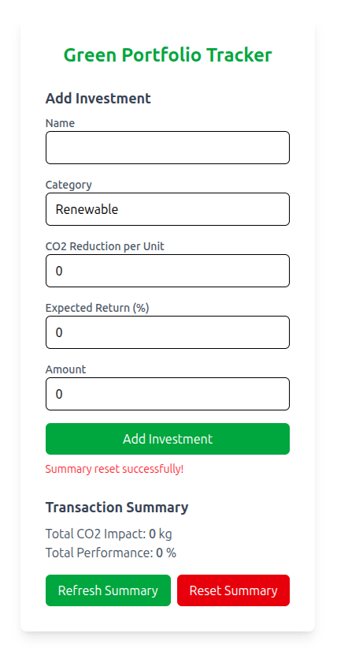

# Green-Portfolio-Tracker

## Context

Ce projet a été développé dans le cadre d'une candidature pour l'entreprise **GoodVest**, une fintech française spécialisée dans l'investissement responsable et durable. Il s'agit de mon premier projet Django. L'objectif était de créer une application en rapport avec GoodVest, tout en mettant en pratique les concepts fondamentaux de Django et du développement d'API REST.

## À propos du projet

Green Portfolio Tracker est une application web fullstack qui permet aux utilisateurs de suivre et d'analyser leurs investissements écologiques et durables. L'application calcule à la fois la performance financière et l'impact environnemental (réduction de CO2) des investissements verts, offrant une vision complète de la rentabilité et de l'impact positif sur l'environnement.

### Fonctionnalités principales

- ✅ **Gestion d'investissements verts** : Ajout d'investissements avec leurs caractéristiques (nom, catégorie, impact CO2, rendement attendu)
- ✅ **Suivi des transactions** : Enregistrement automatique des transactions liées aux investissements
- ✅ **Calcul d'impact environnemental** : Calcul automatique des kg de CO2 évités grâce aux investissements
- ✅ **Analyse de performance** : Suivi du rendement financier des investissements
- ✅ **Interface moderne** : Interface utilisateur intuitive et responsive avec Vue.js et Tailwind CSS
- ✅ **API REST complète** : Backend Django avec endpoints pour tous les besoins
- ✅ **Tests automatisés** : Couverture de tests de 95% avec pytest et amélioration possible sur la connexion

## Architecture technique

### Stack technologique
- **Backend** : Django 5.2.5 + Django REST Framework
- **Frontend** : Vue.js 3 + Tailwind CSS 4
- **Base de données** : SQLite (développement)
- **Authentication** : Basic Authentication (démonstration)
- **Tests** : pytest avec couverture de code
- **CORS** : Configuration complète pour le développement cross-origin

### Structure de l'application

```
Green-Portfolio-Tracker/
├── server/                              # Backend Django
│   ├── green_portfolio_tracker/
│   │   ├── api/                        # App Django principale
│   │   │   ├── models.py              # Modèles Investment & PortfolioTransaction
│   │   │   ├── serializers.py         # Sérialiseurs DRF
│   │   │   ├── views.py               # ViewSets et logique métier
│   │   │   └── tests.py               # Tests unitaires et d'intégration
│   │   ├── settings.py                # Configuration Django
│   │   └── urls.py                    # Routage URL
│   ├── manage.py
│   └── requirements.txt
└── client/                             # Frontend Vue.js
    └── green-portfolio-tracker-client/
        ├── src/
        │   ├── App.vue                # Composant principal
        │   └── assets/main.css        # Styles Tailwind
        ├── package.json
        └── vite.config.js
```

## Installation et démarrage

### Prérequis

- **Python** 3.8+ 
- **Node.js** v20.14.0+ 
- **Git**

### 1. Installation du backend (Django)

```bash
# Cloner le repository
git clone <votre-repo-url>
cd Green-Portfolio-Tracker

# Accéder au dossier server
cd server

# Créer et activer un environnement virtuel
python -m venv venv
source venv/bin/activate  # Sur Windows: venv\Scripts\activate

# Installer les dépendances Python
pip install -r requirements.txt

# Appliquer les migrations
python manage.py migrate

# Créer un utilisateur de test
python manage.py createsuperuser --username testuser --email testuser@example.com
# Mot de passe: testpass123

# Lancer le serveur Django
python manage.py runserver
```

Le backend sera accessible sur `http://127.0.0.1:8000/`

### 2. Installation du frontend (Vue.js)

```bash
# Dans un nouveau terminal, accéder au dossier client
cd client/green-portfolio-tracker-client

# Installer les dépendances npm
npm install

# Installer vue avec vite
npm init vue@latest

# Installer tailwind
npm install -D tailwindcss postcss autoprefixer
npx tailwindcss init -p

# Lancer le serveur de développement
npm run dev
```

Le frontend sera accessible sur `http://localhost:5173/`

## Utilisation de l'application

### Interface utilisateur

1. **Accès à l'application** : Ouvrez `http://localhost:5173/` dans votre navigateur
2. **Formulaire d'investissement** : Remplissez les champs suivants :
   - **Nom** : Nom de l'investissement (ex: "Parc éolien Loire")
   - **Catégorie** : Type d'investissement (par défaut: "Renewable")
   - **CO2 Reduction per Unit** : Réduction de CO2 en kg par unité investie
   - **Expected Return (%)** : Rendement attendu en pourcentage
   - **Amount** : Montant investi en euros

3. **Ajout d'investissement** : Cliquez sur "Add Investment" pour créer l'investissement et la transaction associée

4. **Suivi des résultats** : Le résumé se met automatiquement à jour avec :
   - **Total CO2 Impact** : Total des kg de CO2 évités
   - **Total Performance** : Performance financière totale en euros

### Exemple d'utilisation

```
Nom: Parc solaire Provence
Catégorie: Renewable
CO2 Reduction per Unit: 2.5 kg/€
Expected Return: 6.5%
Amount: 1000€

Résultat:
- Total CO2 Impact: 2500 kg de CO2 évités
- Total Performance: 65€ de rendement attendu
```

## API Endpoints

### Investissements
- `GET /api/investments/` - Liste des investissements
- `POST /api/investments/` - Créer un investissement
- `GET /api/investments/{id}/` - Détail d'un investissement

### Transactions
- `GET /api/transactions/` - Liste des transactions
- `POST /api/transactions/` - Créer une transaction
- `GET /api/transactions/summary/` - Résumé des impacts et performances

### Authentication
L'API utilise Basic Authentication avec les credentials :
- **Username** : `testuser`
- **Password** : `testpass123`

## Tests

### Exécution des tests

```bash
cd server

# Tests unitaires et d'intégration
pytest -v green_portfolio_tracker/api/tests.py

# Tests avec couverture de code
pytest --cov=green_portfolio_tracker.api --cov-report=term-missing green_portfolio_tracker/api/tests.py
```

### Couverture actuelle : 95%

Les tests couvrent :
- ✅ Création d'investissements
- ✅ Calcul des résumés de transactions
- ✅ Validation des données
- ✅ Gestion des erreurs
- ✅ Tests d'intégration complets

## Fonctionnalités techniques mises en œuvre

### Backend Django
- **Modèles** : Investment et PortfolioTransaction avec relations ForeignKey
- **Serializers** : Validation des données avec contraintes métier
- **ViewSets** : API REST complète avec actions personnalisées
- **Cache** : Mise en cache des résumés pour optimiser les performances
- **CORS** : Configuration pour permettre les requêtes cross-origin

### Frontend Vue.js
- **Composants réactifs** : Interface utilisateur dynamique
- **Gestion d'état** : State management avec data() et methods
- **API calls** : Intégration complète avec le backend Django
- **Responsive design** : Interface adaptée à tous les écrans avec Tailwind CSS

<p align="center">
   
</p>

## Améliorations possibles

Ce projet, étant un MVP de démonstration, pourrait être enrichi par :

### Fonctionnalités
- 📊 **Graphiques et visualisations** : Charts.js pour visualiser l'évolution des performances
- 👥 **Multi-utilisateurs** : Gestion complète des comptes utilisateurs
- 💱 **Multi-devises** : Support de différentes devises
- 📱 **Application mobile** : Vue Native ou React Native
- 🔔 **Notifications** : Alertes sur les performances

### Technique
- 🔐 **Authentication JWT** : Système d'authentification plus robuste
- 🗄️ **Base de données PostgreSQL** : Migration vers une base plus robuste
- ☁️ **Déploiement cloud** : Docker + AWS/Heroku
- 🔄 **CI/CD** : Pipeline d'intégration continue
- 📈 **Monitoring** : Logs et métriques applicatives

## Technologies apprises

Ce projet m'a permis d'approfondir :

### Django & Python
- Architecture MVT (Model-View-Template)
- Django REST Framework et création d'APIs
- Système d'authentification Django
- Migrations et modèles de base de données
- Tests avec pytest et fixtures

### Frontend moderne
- Vue.js 3 (Composition API et Options API)
- Tailwind CSS pour le styling
- Build tools modernes (Vite)
- Communication HTTP avec fetch API

### DevOps & bonnes pratiques
- Gestion d'environnements virtuels Python
- Configuration CORS pour applications SPA
- Tests automatisés et couverture de code
- Structure de projet professionnel

## Conclusion

Ce projet Green Portfolio Tracker représente une première approche complète du développement web fullstack avec Django. Il m'a donné l'opportunité d'approfondir plusieurs compétences :

- **Apprendre rapidement** de nouvelles technologies (premier projet Django)
- **Comprendre les besoins métier** d'une fintech comme GoodVest
- **Développer une solution complète** backend + frontend
- **Écrire du code de qualité** avec tests et bonnes pratiques
- **Documenter efficacement** mon travail

---

**Contact** : delemos@hotmail.fr
**LinkedIn** : https://www.linkedin.com/in/brice-delemos-dit-pereira/

## Les commandes pour la base de données avec Django

1. python manage.py makemigrations
    
    Vérifie ce qui a été ajouté dans models.py (ici les classes Investement et PortfolioTransaction). Après avoir vérifier les informations à l'intérieur, elle crée un "plan d'action" pour mettre à jour la base de données. Donc `Préparation des instructions`.

    Crée un fichier (dans : `api/migrations/` nommé : `0001_initial.py` car c'est le premier). Cela permet de voir si il y a un problème et aussi d'avoir une sauvegarde étape par étape de l'avancée de la BDD.

2. python manage.py migrate

    C'est un `exécuteur` qui prend les plans d'actions et les applique à la BDD.
    Dans ce projet la BDD est créé avec sqlite3 pour plus de facilité.

3. python manage.py createsuperuser

    On va stocker un utilisateur dans la table `auth_user` créé par migrate.
    Ce user a accès à l'interface admin de Django

4. python manage.py runserver

    Cela va permettre de lancer un serveur pour tester les précédentes commandes. Il sera lancé à cette adresse : `http://127.0.0.1:8000/admin/`.
    Le frontend visualisé est l'interface admin intégrée de Django (activée par défaut dans `INSTALLED_APS` avec `django.contrib.admin`).
    C'est une page auto-générée pour gérer la BDD.

Django fournit tout pour démarrer vite (auth, amdin, DB tools). Cela évite de coder from scratch comme avec Golang.